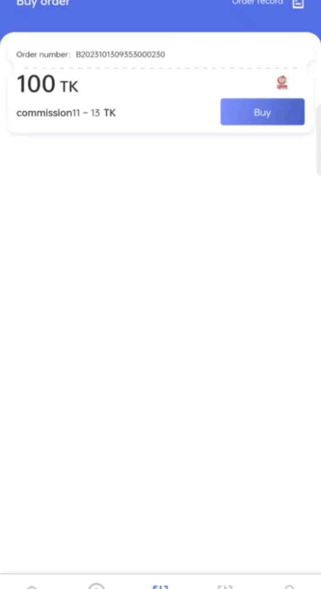

# Vision AI - AI Captcha Solver

<p align="center">
  <h2 align="center">Vision AI - AI Captcha Solver</h2>
  <p align="center">A powerful FastAPI-based service that uses Vision AI to solve text-based and Google recaptcha and Puzzle Image captchas with high accuracy.</p>
</p>

## Overview

The AI Captcha Solver is a machine learning-powered API service that can recognize and extract text from captcha images. It uses a fine-tuned TrOCR (Transformer-based Optical Character Recognition) model to accurately decode text from captcha images, helping automate processes that would otherwise require manual captcha solving.

And for Google Recaptcha solving we use whisper Model to transcribe the audio to text and passing the Text to the input google recaptcha getting easily solved.

And for Puzzle Image Captcha we use OpenCV to detect the puzzle and calculate the coordinates of the piece and solving the puzzle easily.

### Demo

<h2>Google Recaptcha</h2>
<p align="center">
  
</p>

<h2>Puzzle Image Captcha</h2>
<p align="center">
  
</p>

*Note: If you're viewing this on GitHub, you may need to download the video to view it. The demo video is located in the root directory of the repository.*

## Features

- **High Accuracy**: Fine-tuned model specifically for captcha recognition
- **Multiple Input Methods**: Support for both file uploads and base64-encoded images
- **RESTful API**: Easy integration with any application
- **Docker Support**: Simple deployment with Docker
- **Vercel Deployment**: Ready for serverless deployment on Vercel

## Technology Stack

- **FastAPI**: Modern, fast web framework for building APIs
- **Transformers**: State-of-the-art machine learning library for NLP and Vision tasks
- **TrOCR**: Microsoft's Transformer-based OCR model
- **whisper**: OpenAI's state-of-the-art speech recognition model
- **OpenCV**: Open Source Computer Vision library
- **Python 3.9+**: Modern Python for better performance and features

## Getting Started

### Prerequisites

- Python 3.9 or higher
- pip (Python package manager)

### Installation

```bash
# Clone the repository
git clone https://github.com/saifulbabo67646/captcha-solver.git
cd captcha-solver

# Install dependencies
pip install -r requirements.txt